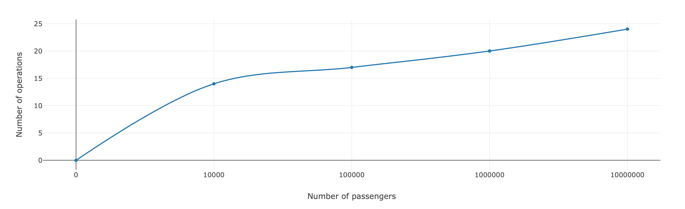

# Airport Queueing :airplane:

The included in the repository Java class - [HeapQueue](HeapQueue.java) - provides an interpretation of a **Prioritized queue algorithm** which was implemented in the scenario of being a queueing system at an airport. The simulation is made in a way that passengers enqueueing and dequeueing process from a waiting line is outputted in the `console`. The mentioned behaviour can be observed by compiling [the example project](https://github.com/datsoftlyngby/soft2019spring-algorithms/tree/master/Weeklies/Week_09/Assignment_03/Airport_Queue_template), the previously mentioned class should be added in the same solution. 

<br/>

As an addition, it should be specified that the template project requires the following alterations to comply with the code:

**[Category.java](https://github.com/datsoftlyngby/soft2019spring-algorithms/blob/master/Weeklies/Week_09/Assignment_03/Airport_Queue_template/src/main/java/dk/cphbusiness/airport/template/Category.java)** - The order of the `enum` was changed to be properly reflected on the priorities 
```java
public enum Category {
  LateToFlight,
  Monkey,
  Family,
  BusinessClass,
  Disabled
}
```

**[Passenger.java](https://github.com/datsoftlyngby/soft2019spring-algorithms/blob/master/Weeklies/Week_09/Assignment_03/Airport_Queue_template/src/main/java/dk/cphbusiness/airport/template/Passenger.java)** - Added a check against `null` to properly handle priority when comparing against an existing object
```java
@Override
public int compareTo(Passenger other) {
  if(other == null)
    return 1;
  if (this.category.compareTo(other.category) != 0)
    return this.category.compareTo(other.category);
  return this.arrivalTime.compareTo(other.arrivalTime);
}
```

<br/>

The chosen approach for implementing the **Prioritized queue** was a `Max Heap Sort`. This allowed for keeping a structure where the passengers with the highest priority would be always on the top of the queue, therefore, providing a reduced cost of dequeueing.

The team had to prove their algorithms performs with a complexity not higher than `O(log N)`. With this purpose the team created an additional program that would calculate the worst case scenario of enquequeing or dequeueing on a specified `N`. Results for the number of operations performed were logged and can be seen on the output and graph below.

<br/>

> Output of the auxiliary program
```
Amount of operations to enqueue last item of 10000 was 14
Amount of operations to dequeue first item of 10000 was 14

Amount of operations to enqueue last item of 100000 was 17
Amount of operations to dequeue first item of 100000 was 17

Amount of operations to enqueue last item of 1000000 was 20
Amount of operations to dequeue first item of 1000000 was 20

Amount of operations to enqueue last item of 10000000 was 24
Amount of operations to dequeue first item of 10000000 was 24
```

> Graph
<p align="center">

</p>

<br/>

> Results

| **№ passengers (N)** | 10000 | 100000 | 1000000 | 10000000 |
| :--- |:---:|:---: | :---:| :---:|
|**Produced results**|14|17|20|24|
|**Approximate Log N**|13|17|20|23|

<br/>

___
> #### Assignment made by:   
`David Alves 👨🏻‍💻 ` :octocat: [Github](https://github.com/davi7725) <br />
`Elitsa Marinovska 👩🏻‍💻 ` :octocat: [Github](https://github.com/elit0451) <br />
> Attending "Algorithms and Data Structures" course of Software Development bachelor's degree
